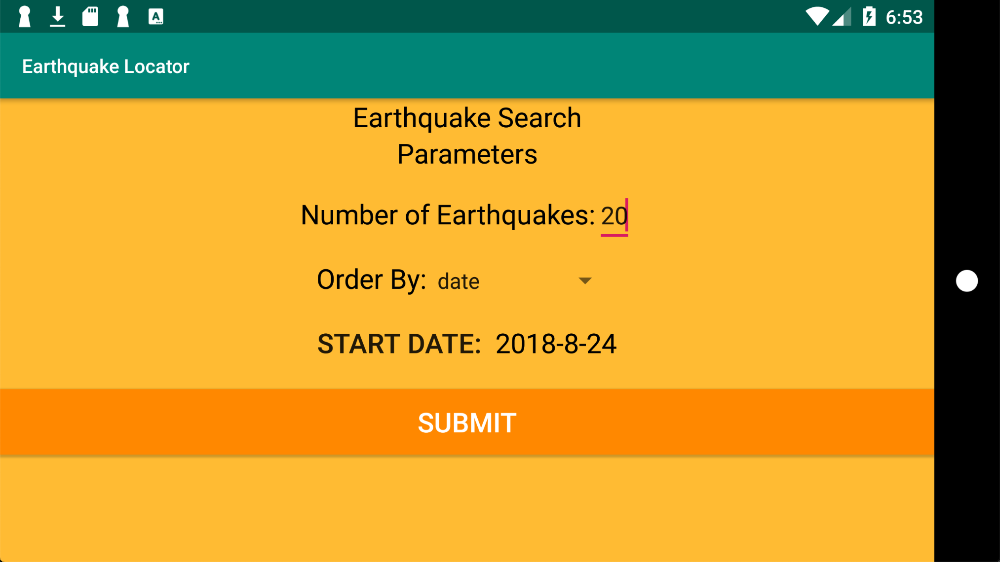
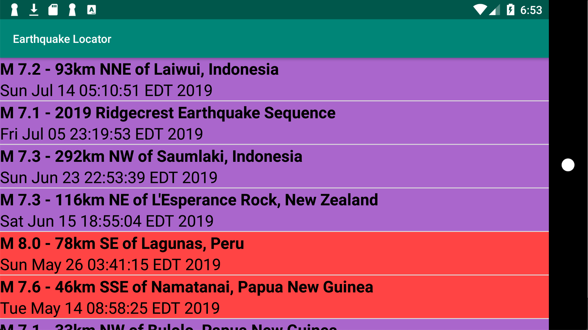
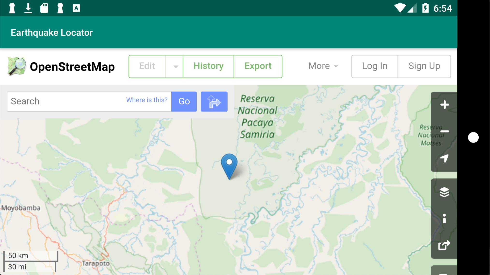

# earthquake-locator

This is an Android app which uses USGS earthquake data (https://earthquake.usgs.gov/) and opens a webview displaying an OpenStreetMap page with the earthquake's co-ordinates. 

Users can set various parameters such as the amount of earthquakes to display, sorting order, and start (set using a date picker dialog).

## Screenshots

### Main View (Parameter Entry)

### List of Earthquakes

### WebView displaying OpenStreetMap page

